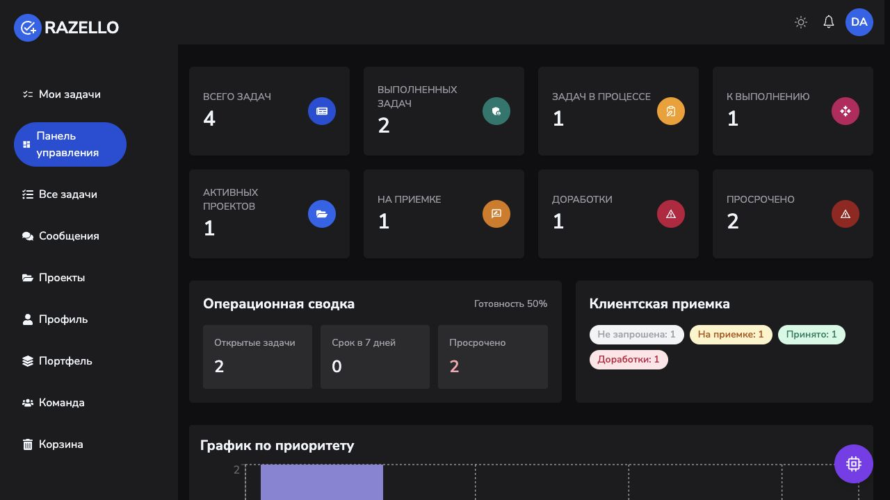
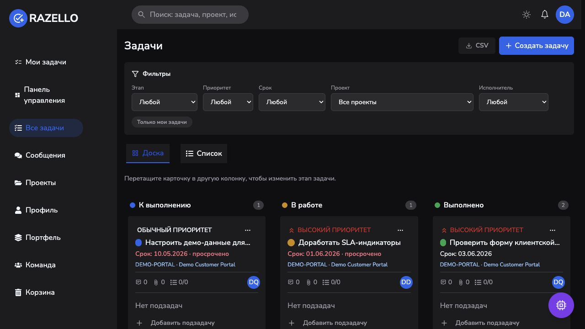
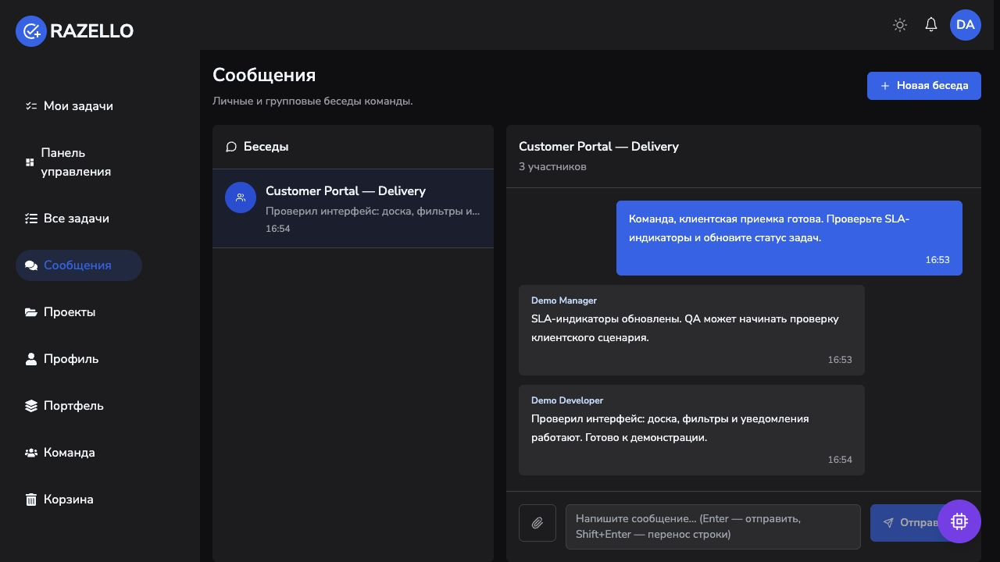

<h1 align="center">Rasul Khattaev</h1>

  Full-stack JavaScript / TypeScript developer building production web products, integrations, 
  automation services, and the infrastructure that keeps them running.

  <a href="https://www.linkedin.com/in/rasul-khattaev-27a55a349/">LinkedIn</a> ·
  <a href="mailto:rkhattaev@yandex.ru">Email</a> ·
  <a href="https://t.me/Nidhogg_0">Telegram</a>

## What I do

- Develop an enterprise HR portal on WebSoft/WebTutor and integrate it with 1C
  and internal corporate systems as part of a three-person team.
- Build full-stack applications with TypeScript, React, Next.js, Node.js, REST,
  PostgreSQL, Prisma, and Redis.
- Own services beyond the application code: Docker, nginx, systemd, Linux,
  deployment, monitoring, and incident recovery.
- Build and operate a subscription-based Twitch automation product while
  maintaining a separate, security-reviewed public core.

## Featured project

### [Razex Task Manager](https://github.com/RAZEX0LOL/razex-task-manager)

A production-ready team workflow platform built with React, Redux Toolkit,
Express, MongoDB, WebSocket, and Bun. It brings projects, Kanban workflows,
client acceptance, real-time conversations, notifications, audit history,
attachments, reporting, and AI-assisted assignment into one product.

**Engineering highlights:** four scoped system roles (`admin`, `manager`,
`employee`, `client`), secure cookie-based JWT sessions with revocation,
project-aware access control, rate-limited AI endpoints with deterministic
fallbacks, Docker/nginx deployment, CI, and 79 automated unit and integration
tests in the full build.

The linked repository is a security-reviewed public engineering snapshot; the
complete product and deployment history remain private.

  

<table>
  <tr>
    <td width="50%">
      
    </td>
    <td width="50%">
      
    </td>
  </tr>
  <tr>
    <td align="center"><strong>Kanban workflow</strong></td>
    <td align="center"><strong>Real-time team messages</strong></td>
  </tr>
</table>

## Selected work

| Project | What it demonstrates |
| --- | --- |
| [Razex Stream Bot](https://github.com/RAZEX0LOL/razex-stream-bot) | Production-derived Twitch automation core with IRC, EventSub, role-based commands, SSRF-resistant fetching, atomic persistence, and 112 tests. |
| [Razex Now Playing](https://github.com/RAZEX0LOL/razex-now-playing) | Real-time Spotify and YouTube Music overlays for OBS with Next.js, SSE, Prisma, PostgreSQL, encrypted credentials, Docker, and 11 tests. |
| [Telegram Business Bot](https://github.com/RAZEX0LOL/telegram-business-bot) | Self-hosted booking, order, request, notification, and admin workflows with Bun, persistent SQLite sessions, hardened systemd, and 13 tests. |
| [OBS Chat Control](https://github.com/RAZEX0LOL/razex-obs-chat-control) | Allow-listed Twitch EventSub control for private OBS/mediamtx deployments, built with Python, TwitchIO, async I/O, systemd, and 12 tests. |
| [Music Player PWA](https://github.com/RAZEX0LOL/music-player-pwa) | Privacy-first offline music player using IndexedDB, Service Workers, Media Session, accessible UI, and 15 tests. |
| [SkyTrack](https://github.com/RAZEX0LOL/SkyTrack) | Responsive flight dashboard with strict TypeScript, URL-driven state, derived telemetry, accessibility checks, CI, and a [live demo](https://razex0lol.github.io/SkyTrack/). |
| [Lloyd Consulting Website](https://github.com/RAZEX0LOL/lloid) | Production client website built with React and Tailwind CSS, available at [ллойд.рф](https://ллойд.рф). |

## Core stack

`TypeScript` · `JavaScript` · `React` · `Next.js` · `Node.js` · `NestJS` ·
`Express` · `PostgreSQL` · `Prisma` · `Redis` · `Docker` · `nginx` · `Linux`

## Beyond web development

I self-host and maintain services on VPS and home-server infrastructure,
including Matrix/Synapse, Nextcloud, media services, and SRT-based streaming.
This gives me practical experience with networking, observability, backups, and
production troubleshooting—not just local development.

**Languages:** Russian — native · English — B1, actively improving

I am open to full-stack JavaScript/TypeScript roles, including remote and
international teams.
